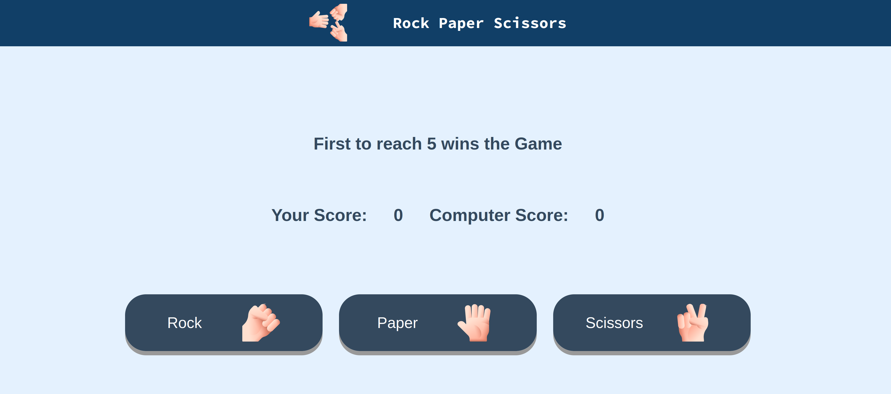

# Rock Paper Scissors Game

## Links

<a href="https://jonuzovic-muhamed.github.io/rock-paper-scissors-game" target="_blank" rel="noopener noreferrer">Play the Game</a> 
<a href="https://www.theodinproject.com/lessons/foundations-rock-paper-scissors" target="_blank" rel="noopener noreferrer">Take a look at the project assignment</a>

## Attribution Links

<a href="https://www.flaticon.com/free-icons/rock-paper-scissors" title="rock paper scissors icons">Rock paper scissors icons created by Freepik - Flaticon</a>

## About

This project is part of the <a href="https://www.theodinproject.com" target="_blank" rel="noopener noreferrer">The Odin Project</a>'s foundations course, which I undertook in order to increase my skill level in modern web development.

For this project I created a simple Rock Paper Scissors Game.

## Preview

